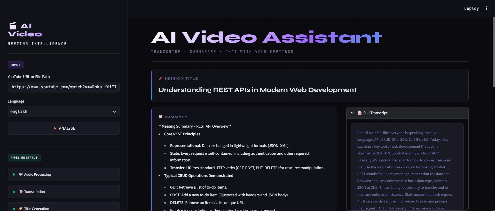
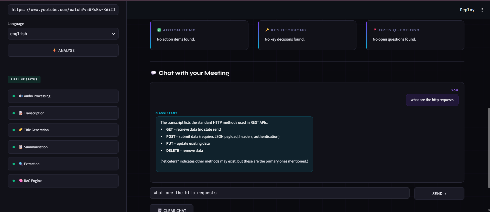

# 🎬 AI Video Assistant — Meeting Intelligence

Turn any YouTube video or local recording into a searchable, chattable knowledge base. Paste a
link or a file path, and get back a title, a summary, action items, key decisions, open
questions — and a chat interface grounded in the actual transcript via RAG.



## Features

- 🔗 **Two input modes** — a YouTube URL or a local file path
- 🌐 **Two transcription engines** — English via local **Whisper**, or Hindi/Hinglish → English
  via **Sarvam AI**'s speech-to-text-translate API
- 🏷️ **Auto-generated title** and a **map-reduce summary** of the full transcript
- ✅ **Action items**, **🔑 key decisions**, and **❓ open questions** extracted automatically
- 💬 **RAG chat** — ask anything about the video; answers are grounded strictly in the transcript,
  with an explicit "I could not find this information" fallback instead of guessing
- 📊 **Live pipeline status** in the sidebar (Audio Processing → Transcription → Title Generation →
  Summarisation → Extraction → RAG Engine)
- 🖥️ **CLI mode** (`main.py`) for running the whole pipeline from a terminal, including an
  interactive chat loop
- 🎨 Fully custom dark "terminal" UI theme built on top of Streamlit



## Architecture

```
YouTube URL or local file path
            │
            ▼
   utils/audio_processor.py
   yt-dlp (YouTube) / pydub (local file) → WAV → chunked into 10-minute pieces
            │
            ▼
     core/transcriber.py
   English  → Whisper (local model, runs on CPU)
   Hinglish → Sarvam AI speech-to-text-translate (25s pieces, ≤30s API limit)
            │
            ▼
      Full transcript (plain text)
            │
   ┌────────┼─────────────────────────────┐
   ▼        ▼                             ▼
 Title   Summary                  Action Items / Decisions / Questions
 (Groq)  (map-reduce, Groq)              (Groq, core/extractor.py)
   │        │                             │
   └────────┴─────────────────────────────┘
            │
            ▼
      core/vector_store.py
   Transcript chunked (500 chars) → all-MiniLM-L6-v2 embeddings → ChromaDB
            │
            ▼
       core/rag_engine.py
   Retriever (top-4 similarity) → Groq LLM → grounded answer
            │
            ▼
        Streamlit chat UI
```

## Tech stack

| Layer | Technology |
|---|---|
| UI | Streamlit, with a fully custom dark-mode CSS theme |
| LLM | [Groq](https://console.groq.com) via `langchain-groq` (`openai/gpt-oss-20b`) — powers title generation, summarization, extraction, and chat |
| Transcription (English) | Local [Whisper](https://github.com/openai/whisper) (`openai-whisper`) |
| Transcription (Hinglish → English) | [Sarvam AI](https://www.sarvam.ai/) `speech-to-text-translate` |
| Embeddings | `sentence-transformers` — `all-MiniLM-L6-v2` (runs locally, no API needed) |
| Vector store | [ChromaDB](https://www.trychroma.com/), persisted to a local `vector_db/` directory |
| Audio | `yt-dlp` (YouTube downloads), `pydub`/ffmpeg (format conversion, chunking) |
| Orchestration | LangChain (LCEL) |

## Project structure

```
ai-rag-video-assistant/
├── app.py                     # Streamlit UI — main entry point
├── main.py                    # CLI entry point (runs the pipeline + terminal chat loop)
├── test.py                    # Quick manual smoke test against a hardcoded YouTube URL
├── core/
│   ├── transcriber.py         # Whisper (English) + Sarvam AI (Hinglish), both with chunking
│   ├── summarizer.py          # Title generation + map-reduce summary (Groq)
│   ├── extractor.py           # Action items / key decisions / open questions (Groq)
│   ├── rag_engine.py          # Vector store → retriever → Groq → grounded chat answer
│   └── vector_store.py        # Chroma + all-MiniLM-L6-v2 embeddings
├── utils/
│   └── audio_processor.py     # yt-dlp / pydub — download, convert, chunk into 10-min pieces
├── requirements.txt
├── packages.txt                # apt packages for Streamlit Community Cloud (ffmpeg)
└── .gitignore
```

## Local setup

### Prerequisites

- Python 3.10+
- [FFmpeg](https://ffmpeg.org/download.html) installed and on your `PATH`
- A [Groq API key](https://console.groq.com/keys) (free tier available)
- A [Sarvam AI API key](https://www.sarvam.ai/) — **only** if you plan to use the Hinglish
  transcription option

### Install

```bash
git clone https://github.com/Saaksshi18/ai-rag-video-assistant.git
cd ai-rag-video-assistant

python -m venv .venv
source .venv/bin/activate        # Windows: .venv\Scripts\activate

pip install -r requirements.txt
```

### Configure environment variables

Create a `.env` file in the project root:

```env
GROQ_API_KEY=your_groq_api_key_here

# Optional — only needed for the Hinglish (Hindi -> English) language option
SARVAM_API_KEY=your_sarvam_api_key_here

# Optional overrides (defaults shown)
WHISPER_MODEL=small
SARVAM_STT_MODEL=saaras:v2.5
```

### Run the Streamlit app

```bash
streamlit run app.py
```

Open the URL Streamlit prints (usually http://localhost:8501). Paste a YouTube URL or a local
file path in the sidebar, pick a language, and click **Analyse**.

### Run from the CLI instead

```bash
python main.py
```

Prompts for a source and language in the terminal, runs the full pipeline, prints the title,
summary, and insights, then drops you into an interactive chat loop with the transcript.

### Quick smoke test

```bash
python test.py
```

Runs the pipeline against a hardcoded sample YouTube URL and prints each stage's output — useful
for confirming your environment (API keys, ffmpeg, model downloads) is set up correctly before
wiring up the full UI. Edit the `source`/`language` variables at the top of the file to test
against a different video.

## Environment variables

| Variable | Required | Description | Default |
|---|---|---|---|
| `GROQ_API_KEY` | Yes | Powers title generation, summarization, extraction, and chat | — |
| `SARVAM_API_KEY` | Only for Hinglish | Powers the Hindi/Hinglish → English transcription option | — |
| `WHISPER_MODEL` | No | `tiny` / `base` / `small` / `medium` / `large` | `small` |
| `SARVAM_STT_MODEL` | No | Sarvam speech-to-text-translate model name | `saaras:v2.5` |

## Deploying to Streamlit Community Cloud

1. Push this repo to GitHub (already done ✅).
2. Go to [share.streamlit.io](https://share.streamlit.io) → **New app** → point it at this repo,
   branch `main`, main file `app.py`.
3. `packages.txt` (already included) tells Streamlit Cloud to install `ffmpeg` automatically.
4. In **Settings → Secrets**, add:
   ```toml
   GROQ_API_KEY = "..."
   SARVAM_API_KEY = "..."
   ```
5. Deploy.

## How the pipeline works

1. **Audio acquisition** (`utils/audio_processor.py`) — YouTube links are downloaded with
   `yt-dlp`; local files are converted to mono 16kHz WAV with `pydub`. Either way, the audio is
   then split into 10-minute chunks before transcription.
2. **Transcription** (`core/transcriber.py`) — each chunk is routed to Whisper (English) or
   sliced further into 25-second pieces and sent to Sarvam AI (Hinglish → English), then all
   chunks are joined into one flat transcript string.
3. **Title & summary** (`core/summarizer.py`) — the transcript is split into ~3000-character
   pieces, each summarized individually (map step), then combined into one final bullet-point
   summary (reduce step) via Groq. A separate call generates a short title from the first 2000
   characters.
4. **Extraction** (`core/extractor.py`) — three separate Groq calls extract action items (with
   task/owner/deadline), key decisions, and open questions from the full transcript.
5. **Indexing** (`core/vector_store.py`) — the transcript is split into 500-character chunks,
   embedded with `all-MiniLM-L6-v2`, and stored in a persistent Chroma collection
   (`vector_db/`, collection name `meeting_transcript`).
6. **Chat** (`core/rag_engine.py`) — a question is embedded, the top-4 most similar chunks are
   retrieved, and Groq answers strictly from that context — explicitly saying "I could not find
   this information in the meeting transcript" rather than guessing when the answer isn't there.

## Known limitations

- **No timestamps.** The transcript is stored and displayed as one flat string; there's no
  per-segment timing, so there's no clickable "jump to this moment" feature and no video player
  in the UI.
- **Shared vector store across videos.** `build_vector_store()` always writes to the same
  persistent Chroma collection (`vector_db/`, `meeting_transcript`). Analyzing a second video in
  the same environment adds its chunks to the same collection rather than replacing them, so RAG
  answers could draw on a previous video's transcript too. Delete the `vector_db/` folder between
  videos if you want a clean slate.
- **Session-only results.** Everything shown in the Streamlit UI lives in `st.session_state` —
  refreshing the browser clears the title/summary/insights/chat and requires re-running Analyse.
- **CPU-bound transcription.** Whisper runs locally with no GPU acceleration configured; larger
  model sizes or longer videos will take proportionally longer, especially on free-tier hosting.
- **`downloades/` and `vector_db/` grow over time.** Downloaded audio and the vector index persist
  on disk indefinitely (both are gitignored, but not auto-cleaned).

## Future improvements

- Real timestamps carried from transcription through to chat citations, with click-to-seek and an
  embedded video player
- Per-video (rather than shared) vector collections
- Persistent history across sessions (currently in-memory only)
- Streaming chat responses
- PDF/export of the summary and insights (`reportlab`/`fpdf2` are already in `requirements.txt`
  for this, not yet wired up)
